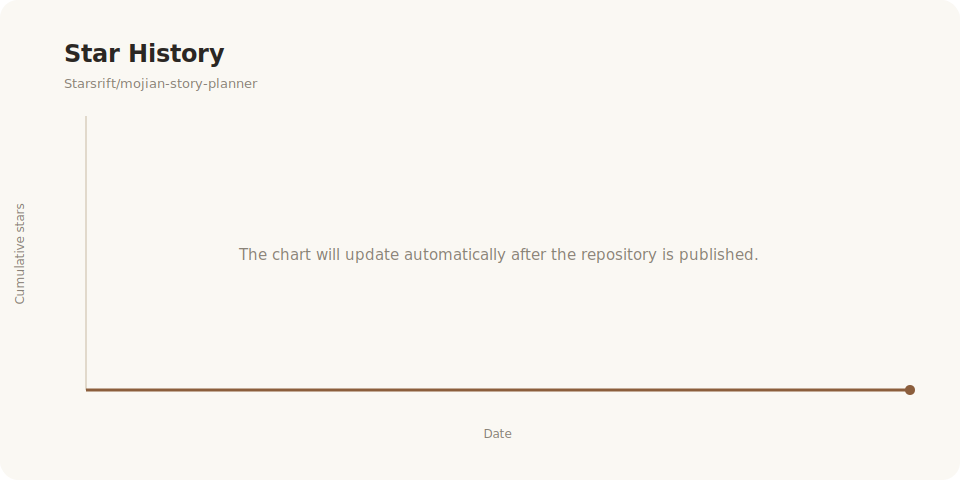

<div align="center">

# 墨笺 · Mojian Story Planner

**一个本地优先、可视化的小说策划工作台。**

用结构板、人物关系图、时间线、伏笔表和世界观百科，把复杂故事整理成清晰、可持续维护的创作系统。

[](https://react.dev/)
[](https://www.typescriptlang.org/)
[](https://vite.dev/)
[](./LICENSE)

</div>

## 项目简介

墨笺不是正文生成器，而是一套面向长篇小说、剧本和复杂叙事创作的策划工具。它帮助创作者在正式写作前建立故事骨架，并在创作过程中持续检查人物关系、事件顺序、伏笔回收和世界观一致性。

项目采用本地优先设计，无需注册账号。所有作品默认保存在当前浏览器的 IndexedDB 中，并支持 JSON 备份导出与恢复。

## 核心功能

| 模块 | 能力 |
| --- | --- |
| 作品总览 | 汇总章节、角色、时间线、伏笔和百科进度，提示下一步需要补全的内容 |
| 故事结构板 | 创建、拖拽和连接章节卡片，记录摘要、关键情节、幕次与灵感片段 |
| 人物关系图 | 管理角色档案，通过不同关系类型构建人物网络 |
| 多轨时间线 | 按主线、支线或角色线组织事件，关联章节与参与角色 |
| 伏笔追踪 | 记录伏笔埋设、回收章节、状态与优先级，检查未闭合伏笔 |
| 世界观百科 | 管理人物、地点、物品、组织、概念和事件词条 |
| 本地数据管理 | 自动保存、作品切换、JSON 备份导出与完整恢复 |
| 体验能力 | 明暗主题、响应式布局、键盘焦点和按需加载 |

## 技术栈

- React 19 + TypeScript 6
- Vite 8
- Zustand：应用状态管理
- Dexie / IndexedDB：浏览器本地持久化
- React Flow：故事结构板与人物关系图
- D3：可视化能力支持
- mise：可选的项目级 Node.js 环境管理

## Release 安装说明

墨笺的 Release 分发规则如下：

- `v1.0`：Release 中如提供 `.dmg` 或 `.exe`，可按系统安装器提示完成安装。
- `v1.0` 之后：Release 仅提供压缩包形式，不再提供 `.dmg` 或 `.exe` 安装包。
- 压缩包版本无需写入系统应用目录。下载后解压到本地目录，再按下方 macOS / Windows 启动方式运行。

建议解压到路径简单、可读写的位置，例如 Windows 的 `D:\Apps\mojian-story-planner`，或 macOS 用户目录下的 `~/Applications/mojian-story-planner`。

## 快速开始

如果你下载的是 Release 压缩包，先完整解压项目目录，再使用下面对应系统的启动脚本。首次启动会根据选择安装依赖并启动本地开发服务。

### macOS

直接双击项目根目录中的：

```text
start-macos.command
```

启动向导会询问你的使用方式：

1. 熟悉开发环境：推荐使用 mise 管理项目 Node.js 版本。
2. 不熟悉开发环境：使用电脑中全局安装的 Node.js。

如果系统提示没有执行权限：

```bash
chmod +x start-macos.command
./start-macos.command
```

### Windows

直接双击：

```text
start-windows.bat
```

技术用户可选择 mise；普通用户可以直接使用全局 Node.js。

如果从压缩包解压后双击脚本没有反应，可在项目目录中打开 PowerShell 或终端，执行手动启动命令。

### 手动启动

要求 Node.js `20.19+`、`22.12+` 或更新版本，推荐 Node.js 24 LTS。

```bash
git clone https://github.com/Starsrift/mojian-story-planner.git
cd mojian-story-planner
npm install
npm run dev
```

使用 mise：

```bash
mise install
mise run install
mise run dev
```

浏览器访问终端中显示的本地地址即可。

## 构建

```bash
npm run build
npm run preview
```

生产文件会生成到 `dist/`。

## 数据与隐私

- 作品数据默认只存储在当前浏览器的 IndexedDB 中。
- 项目不要求登录，也不会主动上传作品内容。
- 清理浏览器站点数据前，请先从作品菜单导出 JSON 备份。
- 恢复备份时，墨笺会创建独立副本并重建章节、人物及关联关系，避免覆盖原作品。

## 项目结构

```text
src/
├── components/       # 结构板、人物图、时间线、伏笔表、百科等界面
├── db/               # Dexie / IndexedDB 数据库
├── store/            # Zustand 状态与业务操作
├── styles/           # 全局主题与响应式样式
├── types/            # 核心数据类型
└── App.tsx           # 应用入口与视图按需加载
```

## 开源协作

欢迎提交 Issue 和 Pull Request。适合贡献的方向包括：

- Markdown 正文编辑与章节字数统计
- 更多故事结构模板
- 数据导入导出格式扩展
- 搜索、标签和全局关联
- 可访问性与移动端体验
- 自动化测试与国际化

提交前请运行：

```bash
npm run build
```

## License

本项目基于 [MIT License](./LICENSE) 开源。

## Star History

下图由仓库内的 GitHub Action 每日自动更新，横轴为日期，纵轴为累计 Star 数量。



<div align="center">

如果墨笺对你的创作有帮助，欢迎点一个 Star ⭐

</div>
